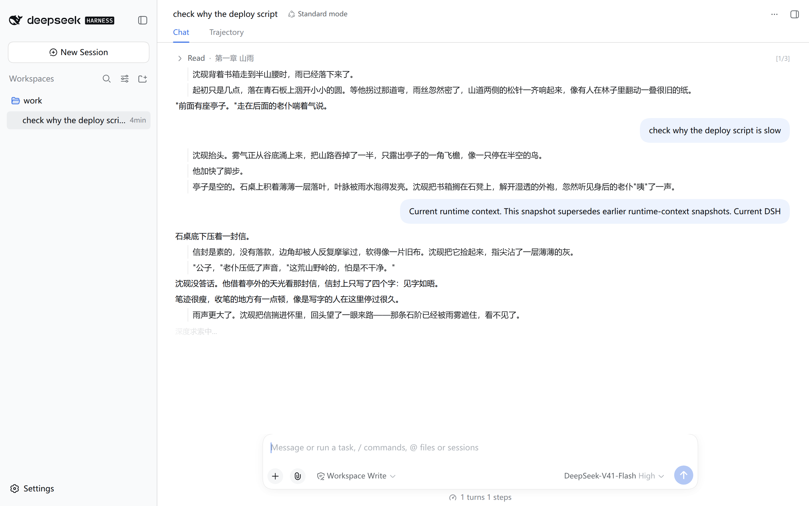
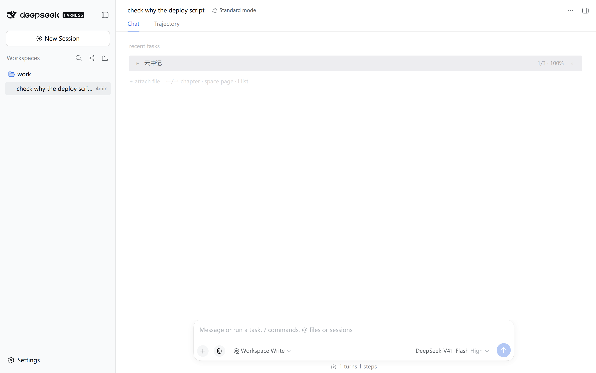

# dsh-stealth-reader

[](https://github.com/Tonited/dsh-stealth-reader/actions/workflows/ci.yml)
[](LICENSE)

> 在 DeepSeek Harness 的会话界面里看小说。屏幕上永远是「一个正在跑的长任务」。



上图的右侧会话区里，**小说正文和工作痕迹行交错出现，正一个字一个字长出来** ——
顶部的标题栏与 Tab、底部的输入框、左侧的栏，全都是真实的界面，插件只占据中间那段消息区。

## 它是什么

一个 **DSH 客户端插件**（纯前端，宿主侧不做任何事）。导入 `.txt` / `.epub`，
按一下快捷键，右侧会话区就变成一股正在流式输出的日志流：

```
> Read 第一章 山雨                                     [1/3]

  沈砚背着书箱走到半山腰时，雨已经落下来了。

  起初只是几点，落在青石板上洇开小小的圆。

  "前面有座亭子。"走在后面的老仆喘着气说。

                    check why the deploy script is slow

  沈砚抬头。雾气正从谷底涌上来，把山路吞掉了一半。

  他加快了脚步。
```

小说段落以 DSH 自己的两种身份出现：**AI 回复正文**，或者**带左侧细竖线的子内容**
（约七成是后者，视觉上就是"工具输出"）。章节标题伪装成一次 `Read` 工具调用 ——
DSH 的消息流里没有"章节标题"这种东西。

## 三个不显然的设计

**工作痕迹行是真的。** 日志流里那些工具调用、命令摘要、用户提问，来自**你当前会话的真实历史**，
不是编出来的假日志。"这看起来就是我的会话"这件事因此是真的 —— 编出来的日志经不起多看两眼。

**退出只认鼠标。** 鼠标移动 1px 或点一下，立刻回到 DSH 真实界面。键盘**不会**退出 ——
否则读到一半会被自己按没（翻页、跳章都要用键盘）。唯一例外是书单：它要靠鼠标点，
所以在书单里鼠标不触发退出，出口是快捷键（见 [ADR-0007](docs/adr/0007-list-does-not-dismiss-on-mouse.md)）。

**没有"书页模式"。** 衬线字体 + 居中 + 大留白的排版一眼就是小说阅读器，那本身就是最大的暴露面。
所以只有一种形态：伪装成日志流的正文。

## 兼容性：DSH 0.1.7 适配（0.2.0）

0.1.7 改了客户端插件与基线原语的几处契约，本插件按**实际安装产物**逐条对齐
（不是按文档 —— 有一处官方 `.d.ts` 注释至今还写着与运行时代码矛盾的说法）。
改动与物证都写在源码注释和 [CHANGELOG](CHANGELOG.md) 里，这里只列最容易踩的四个：

| 契约 | 0.1.7 的实际形态 | 不改会怎样 |
| --- | --- | --- |
| `MarkdownText` / `DisclosureRow` | 是 `React.memo(...)` 的产物，`typeof` 为 `'object'`（`$$typeof` = `Symbol(react.memo)`） | 用 `typeof x === 'function'` 判存在性会把它们判成"基线没有这个原语"，整条渲染路径**静默**降级 |
| `MarkdownText.labels` | 可选 → **必填**，且渲染器无保护解引用 | 正文里一旦出现代码块或脚注就 TypeError，那一段阅读流整条消失（只在特定章节复现） |
| 当前会话 id | `SessionListState` **没有** `current` 字段；`sessions.binding(id)` 只对已 retain 的会话有效 | 拿不到真实会话事件流，伪装内容会退化成硬编码模板（违反 ADR-0002） |
| 图标名 | `Icon…Outline14` / `Outline16` → `Icon…OutlineRegular` / `Medium` | 旧名在 0.1.7 里一个都不存在，图标全部消失 |

插件对旧版 DSH 仍然可用：图标走「新名 → 旧名」降级链，`labels` 兜底只在缺失时生效。

## 安装

需要 DeepSeek Harness 的 `dsh` CLI，以及一个启用了 Web 客户端的 profile（下面以 `web` 为例）。

**从 GitHub 安装（推荐）** —— 固定到一个具体 commit，装到的内容永远可复现：

```bash
dsh plugin --profile web add 'github:Tonited/dsh-stealth-reader#<40 位 commit>'
```

**从 npm 安装**：

```bash
dsh plugin --profile web add dsh-stealth-reader
```

**从本地目录安装**（改源码时）：

```bash
dsh plugin --profile web add 'file:/path/to/dsh-stealth-reader'
```

三种方式都**不需要**手工登记：`dsh plugin add` 会把任何声明了 `dsh.bundle` 的依赖
自动加进 profile 的 `dsh.profile.bundles` 层列表，卸载时也会自动移出。

装完**重启 `dsh web`**（新增插件行需要重启；之后的改动都是热替换，刷新页面即可）。

## 权限与风险

| 项目 | 情况 |
| --- | --- |
| 网络 | **不发起任何网络请求**，无遥测、无外部服务 |
| 文件 | 只读你主动拖进窗口的书文件；不写工作区目录，不改 profile 文件 |
| 存储 | 书与进度只存在浏览器 IndexedDB（库名 `dsh-stealth-reader`），清除浏览器数据即消失 |
| 会话数据 | 会**只读**当前会话的消息历史（用来取真实工作痕迹行），仅在本地渲染，不外发 |
| DSH 本体 | 只挂 `shell.overlay` 与 `conversation.input.dock` 两个槽位；不修改、不替换任何 `@deepseek-ai/*` 官方包 |
| 依赖 | 零运行时依赖（epub 解压库在构建期打进 `lib/client.js`） |
| 生命周期脚本 | 无 `preinstall` / `install` / `postinstall` / `prepare` |

**已知风险，请务必理解：**

- **这是"紧急遮屏"，不是访问控制。** 它只覆盖 DSH 的会话区。任务栏、窗口标题、
  浏览器标签页、历史记录、以及 DSH 之外的任何东西，它都管不了。不要把它当成对付技术审计的手段。
- **快捷键没有仲裁。** DSH 客户端插件没有键位绑定 API，插件只能自己挂 `window` 的 keydown 监听。
  如果别的插件也用了 `Ctrl+Shift+Alt+Z`，按下时两边都会响应。要改键位见下方「手感旋钮」。
- **`stream` 态下鼠标一动就退出**，包括你只是想挪一下鼠标。这是刻意的：被撞见时没有时间判断状态。
  **书单是例外** —— 在书单里鼠标不触发退出（否则点不到书），此时要靠快捷键收场；
  而且书单里的书名是明文的，别让它长时间挂在屏幕上。
- **屏幕上会出现你真实在做的事。** 工作痕迹行取自真实会话历史（路径会被脱敏），
  但它终究是你的会话内容 —— 在共享屏幕时请自行判断。

## 用法

| 你想做的事 | 操作 |
| --- | --- |
| **开始看书 / 藏起来** | `Ctrl+Shift+Alt+Z`（同一个键来回切） |
| **回到工作界面** | **动一下鼠标或点一下**（书单里除外，那儿只能用快捷键） |
| **翻页** | 滚轮 / 空格 / PageDown |
| **上下微调** | `↑` `↓`（一次滚十行正文） |
| **看得比它写得快** | 按住 `Shift` + `↓` / `→` 快进，松开回到正常速度 |
| **跳章** | `←` `→`（也可用 `[` `]`），一次一章 |
| **快速跳章** | 按 `L` 打开书架，点书行右侧的 `≡` 展开步骤清单，滚动点选 |
| **换书 / 导入** | 按 `L` 打开任务列表；把文件**拖进窗口**即可添加 |

任务列表伪装成一份「最近的任务」，进度就是百分比：



## 阅读进度

进度记的是**你读到哪儿**（已输出字符占全章的比例），不是滚到哪儿。

关掉再打开，会**精确停在上次离开的地方**，视口自动跟过去，从那儿继续长出来。
读到章末关掉就停在章末，想继续按 `→` 翻下一章。

## 导入

- `.txt`：自动识别 UTF-8 / GBK。
- `.epub`：插图会保留（渲染成占位图），DRM 加密的书会明确报错且不入库。
- 书**只存在本机浏览器**的 IndexedDB 里，不上传、不进入工作区目录。

## 手感旋钮

节奏、键位、占比都是源码常量，各自只有一处：

| 想调什么 | 去哪 |
| --- | --- |
| 逐字输出的节奏（速度 / 每行最短最长） | `src/client/typing.ts` → `DEFAULT_TEMPO` |
| 快捷键 | `src/client/keys.ts` → `DEFAULT_SHORTCUT` |
| `↑` `↓` 一次滚几行 | `src/client/scroll.ts` → `LINES_PER_ARROW` |
| 工作痕迹的占比 | `src/client/stream.ts` → `DEFAULT_TOOL_OUTPUT_RATIO` |

改完跑 `pnpm run check && pnpm run deploy`。

## 一个必须知道的取舍

伪装阅读牺牲了阅读舒适度：等宽字体、行间插着工作痕迹行，比在阅读器里读书累。
这是**刻意的取舍** —— 目标是"屏幕任何时候看起来都像在工作"，而不是"读得舒服"。

## 开发

```bash
pnpm install
pnpm run check     # 类型检查 + 构建 + 测试（171 个）
pnpm run build     # 只构建
pnpm run deploy    # 构建并拷进已装好的 DSH profile
pnpm run watch     # 构建并监听
```

契约与设计理由在 `SPEC.md`、`CONTEXT.md` 与 `docs/adr/`；
DSH 界面的实测数据（选择器、样式、事件形状）在 `docs/dsh-conversation-ui.md`。

### 为什么 `lib/` 进版本库

构建产物 `lib/` 是**提交进仓库**的，而不是发布时才生成。

从 git 安装第三方 DSH 插件时不应该执行构建脚本 —— 仓库里的 `prepare` 脚本是典型的供应链攻击面，
pnpm 默认就拒绝执行（`ERR_PNPM_GIT_DEP_PREPARE_NOT_ALLOWED`）。所以安装时直接消费仓库里
已经构建好的 `lib/`，全程没有任何生命周期脚本。

代价是产物可能与源码脱节，所以 CI 里有一条检查：源码改了但 `lib/` 没重新构建会直接失败。
**改完源码请务必提交重新构建后的 `lib/`。**

## 许可

[MIT](LICENSE)。

> 截图与文档中的书籍《云中记》是为演示虚构的文本，不是真实出版物。
